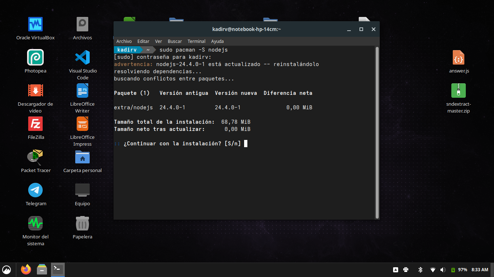
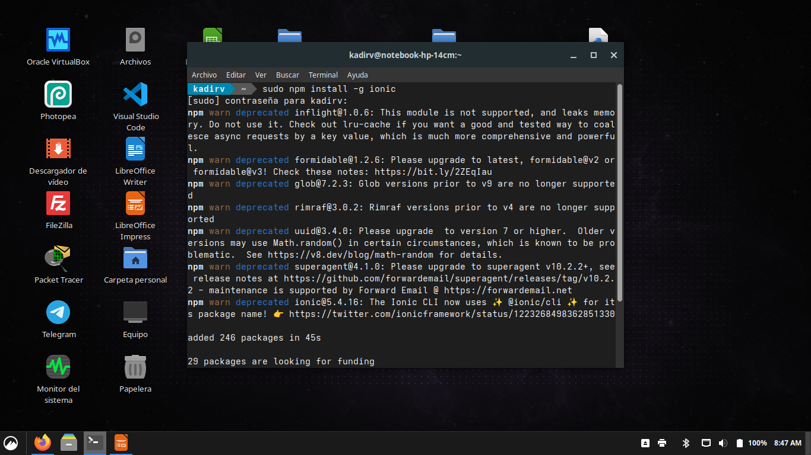
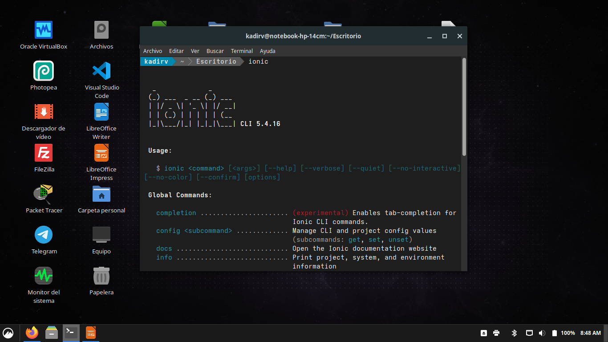
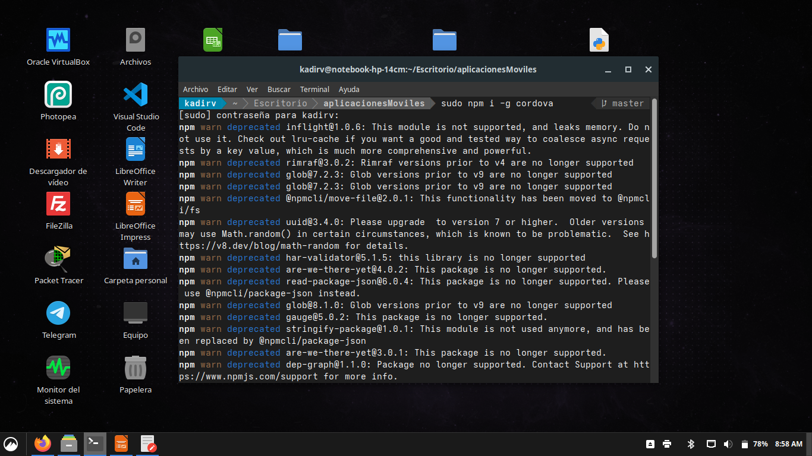
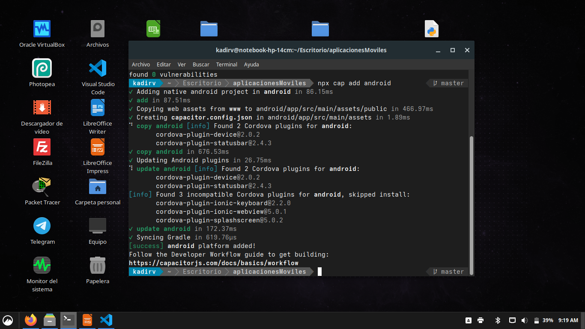
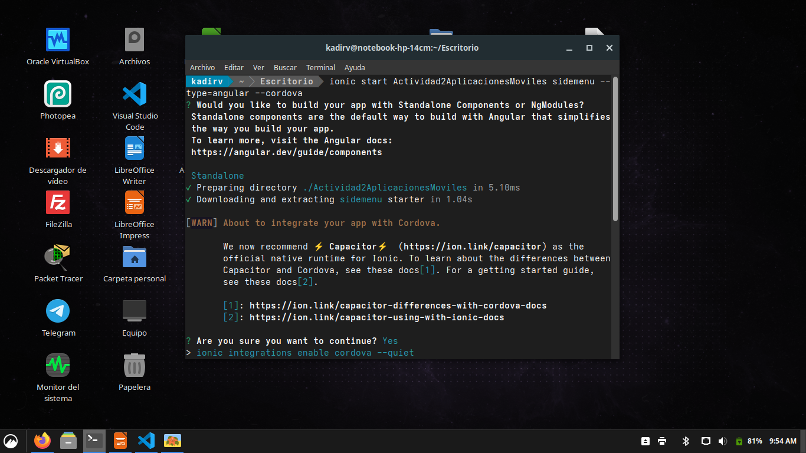
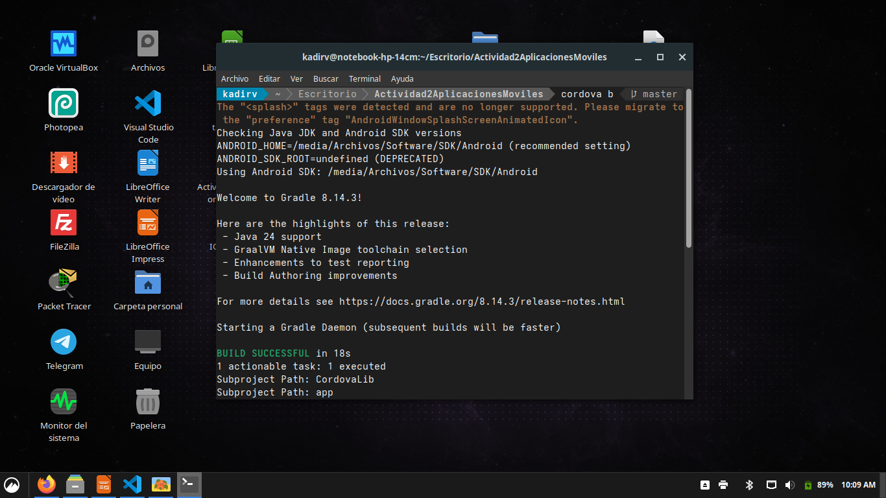

# Actividad 2 - Aplicaciones Móviles

Este documento describe los pasos realizados para crear la aplicación móvil.

---
## 1. Instalar Node.js

## 2. Instalar Ionic

## 3. Instalar Cordova

## 4. Agregar Android como plataforma

## 5. Instalación de Android SDK (archivos ya incluidos en variables de entorno)

## 6. Crear aplicación Actividad2AplicacionesMoviles

## 7. Compilar APK con `cordova build android`

## 8. Aplicación instalada en dispositivo Android

## 9. Aplicación ejecutándose

---

**Autor:** Rafael Kadir Oporto Valencia
**Fecha:** 13/08/2025
