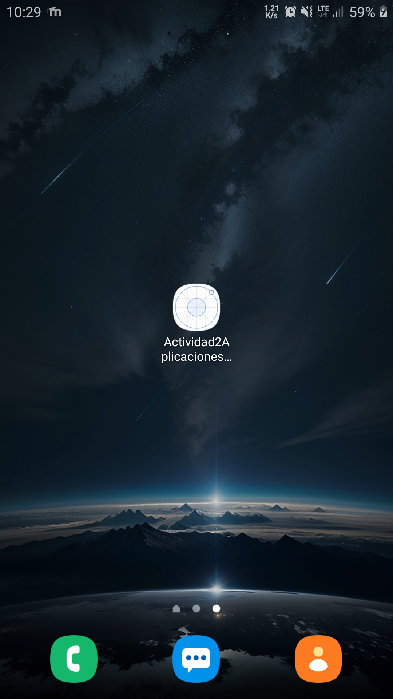

# Actividad 2 - Aplicaciones Móviles

Este documento describe los pasos realizados para crear la aplicación móvil.

---
## 1. Instalar Node.js

## 2. Instalar Ionic

## 3. Ionic funcionando

## 4. Instalar Cordova

## 5. Agregar Android como plataforma

## 6. Instalación de Android SDK (archivos ya incluidos en variables de entorno)

## 7. Crear aplicación Actividad2AplicacionesMoviles

## 8. Compilar APK con `cordova build android`

## 9. Aplicación instalada en dispositivo Android

## 10. Aplicación ejecutándose

---

**Autor:** Rafael Kadir Oporto Valencia
**Fecha:** 13/08/2025
